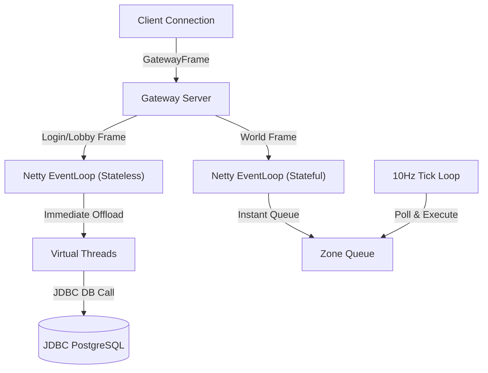

# Catalyst MMO: Protocol Conversion & Phase 2.5 Dispatcher Assessment

This document outlines the current state of the Catalyst network architecture after the successful migration to Apache Fory (Fury) serialization and the implementation of stateful gateway routing, and maps out the next steps for implementing the **Phase 2.5 Concurrency Dispatcher**.

---

## 🟢 Current State: Stateless Gateway & Fory Serialization

We have resolved all critical gateway design issues identified in the initial review:
1. **DTO-Agnostic Routing:** The gateway is now completely decoupled from application DTOs and reflection. It routes messages purely at the transport level using [`GatewayFrame`](file:///home/samuel/projects/ffxi-java/common/network/src/main/java/catalyst/common/network/GatewayFrame.java).
2. **Stateful Connection Management:** The gateway tracks the state of each client connection in-memory (`UNAUTHENTICATED` -> `AUTHENTICATED` -> `PLAYING`). This prevents unauthorized routing requests and eliminates the need to inspect payloads for `sessionId` keys.
3. **No Performance Hacks:** Removed `RawFrameCaptureHandler` and the manual byte-copying/accumulation arrays (`PENDING_FRAMES`), ensuring that transport bytes flow efficiently through Netty's native pipeline.
4. **Fory Symmetrical Codec:** `ForyDecoder` and `ForyEncoder` now extend Netty's message-to-message codecs, sitting cleanly on top of `GatewayFrame` to decode and encode application objects.

---

## 🚧 Upcoming Phase: Concurrency & Database Dispatching (Phase 2.5)

Now that the transport framing and gateway architecture are clean, we must address the remaining concurrency bottlenecks in the backend microservices.

### The Problem: Blocking Netty Event Loop Threads
Currently, the backend server transports (`QuicServerTransport` in Login, Lobby, and World Services) process incoming requests synchronously on the Netty EventLoop thread. 
* Handlers like `LobbyHandler` and `LoginHandler` perform synchronous JDBC database queries and heavy crypto operations (Argon2id).
* Executing these blocking calls directly on the EventLoop thread blocks Netty from reading/writing packets, resulting in severe packet loss and connection drops under load.

### The Solution: The Offload Pattern
We will implement the dispatching model defined in the [Phase 2.5 Concurrency Dispatcher Blueprint](file:///home/samuel/projects/ffxi-java/docs/architecture/phase-2.5-concurrency-dispatcher.md).

#### 1. Stateless Dispatching (Login & Lobby Services)
* **Goal:** Maximize concurrent database lookup speeds.
* **Mechanism:** Implement `StatelessMessageDispatcher` in `server-common`. Upon receiving a decoded packet, Netty instantly offers it to an internal queue and returns to listening. A virtual-thread-per-task executor (`Executors.newVirtualThreadPerTaskExecutor()`) picks up the command, safely executing blocking database queries off the EventLoop.

#### 2. Stateful Dispatching (World Service)
* **Goal:** Prevent database race conditions (e.g. concurrent looting duplication).
* **Mechanism:** Implement `ZoneMessageDispatcher` inside `world-service`. Packets are offered to a non-blocking queue and processed sequentially on a single virtual thread running at a **10Hz Tick Rate (100ms interval)**.

#### 3. Command/Handler Refactoring
To support this automated dispatching:
* Migrate monolithic handlers (`LoginHandler`, `LobbyHandler`, `WorldHandler`) into individual, decoupled strategy classes implementing the `PacketHandler<T>` interface.
* Use Micronaut dependency injection (`BeanProvider<PacketHandler<?>>`) to automatically register these handlers inside the dispatchers.

#### 4. Game Client Integration
* Implement `ClientDispatcher` in `client/engine` to act as an inbox.
* Inbound packets are enqueued by Netty and polled sequentially by the GLFW/ImGui render loop at 60 FPS, ensuring that network packets do not trigger OpenGL concurrency crashes.
