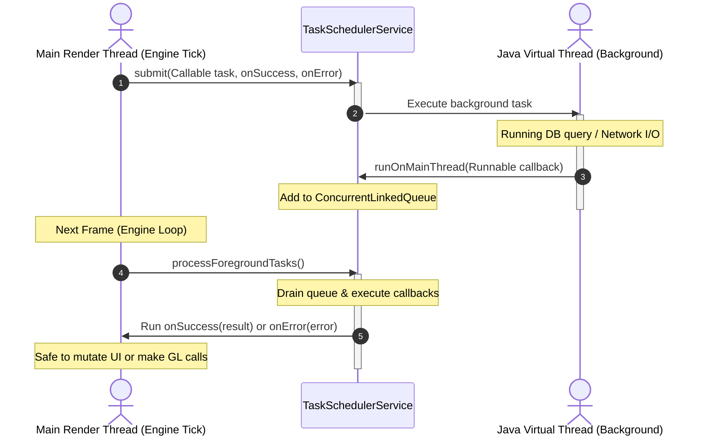

# Client Engine & Application Architecture

This document tracks the details, design decisions, and future tasks for the Catalyst Client and Engine.

---

## 📐 Architecture Details

The client architecture is split into two modules:
1. **`catalyst-client-engine` (`engine`):** 
   * Handles GLFW window lifecycle and OpenGL 4.6 core profile context bindings.
   * Manages render loop ticking (GLFW swap buffers & ImGui rendering).
   * Runs the foreground callback dispatcher queue (`TaskSchedulerService`) to ensure background virtual thread completions are only executed on the main thread (avoiding OpenGL thread-safety crashes).
2. **`catalyst-client-application` (`client`):**
   * Manages UI state and game flow via a stack-based State Machine (`ApplicationStateService`).
   * Hosts states like `UnauthenticatedState`, local boots, character selection screens, etc.
   * Handles the `QuicGateway` connection logic.

### 🧵 Concurrency & Dispatch Model

Background tasks utilize a thread-safe queue that drains callbacks on the main render thread to prevent OpenGL multi-threaded mutation crashes.

---

## 📋 TODO Tasks (Unprioritized)

- **Integrate Client Dispatcher:** Implement `ClientDispatcher` inside the game update loop to poll Fory-deserialized packets off the Netty thread and execute mutations safely on the single main GLFW/ImGui thread.
- **Lobby UI Development:** Implement ImGui panels for character listing, creation (validating race/face/nation choices), and character selection.
- **Connection Migration & Handshake Resiliency:** Handle QUIC connection drop-outs, network switching events, and auto-reauthentication gracefully in the client state machine.
- **Background Asset Preloading:** Use virtual threads (`TaskSchedulerService`) to load 2D UI textures and sprites asynchronously, piping the raw image bytes to the foreground queue for OpenGL texture registration.
