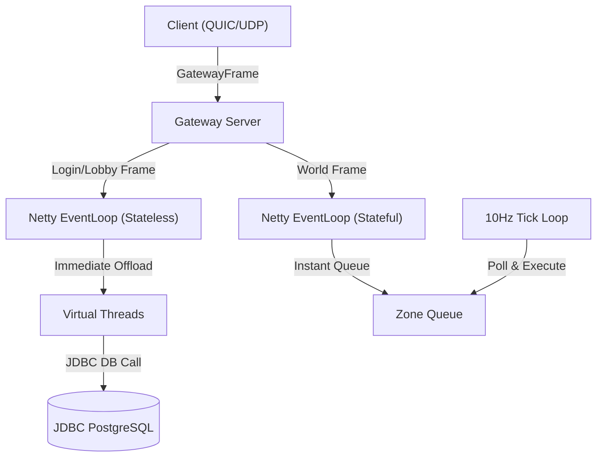

# ADR 0001: Stateful Gateway Routing & Apache Fory Serialization

* **Status:** Accepted
* **Date:** 2026-08-07
* **Author:** Antigravity & Catalyst Team

---

## 1. Context & Problem Statement

In the early stages of Catalyst, client-server communications were built on a temporary text-delimited framing protocol (`MessageFrame`). The initial Gateway Server implementation suffered from several architectural issues (referred to as "sins"):
1. **Tight Coupling:** The gateway imported application DTOs (`LoginRequest`, `PlayResponse`, etc.) and used reflection to inspect inner properties (such as `worldAddress` or `sessionId`) to determine routing.
2. **Blocking Operations:** The gateway executed synchronous, blocking client requests (`future.get()`) inside Netty EventLoop threads, which degraded throughput and caused packet dropouts under load.
3. **Improper Buffering:** A Netty handler (`RawFrameCaptureHandler`) was used to buffer bytes, leading to unnecessary memory copies and garbage collection overhead.
4. **Delimited Protocol:** The text-delimited protocol was slow, insecure, and consumed excessive bandwidth.

We needed a high-performance, DTO-agnostic gateway proxy architecture that maintains secure connection states without blocking threads or deserializing game logic payloads.

---

## 2. Decision & Technical Specification

We made the following structural changes to the networking core:

### 2.1 Transport Framing Envelope (`GatewayFrame`)
We introduced a lightweight binary envelope, [`GatewayFrame`](file:///home/samuel/projects/ffxi-java/common/network/src/main/java/catalyst/common/network/GatewayFrame.java), to wraps all network DTO payloads. It has zero knowledge of Fory/Fury payloads and contains only three fields:
* `flag` (1 byte): Defines destination routing (`0x01` = Login, `0x02` = Lobby, `0x03` = World, `0x80` = Control).
* `metadata` (UTF-8 string): Lightweight routing headers (used exclusively for gateway signals/redirects).
* `payload` (`byte[]`): The raw Fory-serialized game message body (treated as opaque bytes by the gateway).

### 2.2 Apache Fory Serialization Protocol
We migrated the entire network stack to **Apache Fory (Fury)** for binary serialization, centralized via [`ForySerializer`](file:///home/samuel/projects/ffxi-java/common/network/src/main/java/catalyst/common/network/ForySerializer.java). All game DTO records implement a marker interface `GatewayMessage` to define their destination flags and metadata.

### 2.3 Stateful Gateway Connection Machine
The gateway tracks connection routing states dynamically in-memory on the parent QUIC channel:
* **`UNAUTHENTICATED`:** The client is restricted. The gateway routes all packets strictly to the Login Service (regardless of destination flag).
* **`AUTHENTICATED`:** The client has successfully authenticated. The gateway permits routing to Login and Lobby Services.
* **`PLAYING`:** The client has selected a character and entered the game. The gateway permits routing to World Services.

### 2.4 Decoupled Gateway Control Messages
To trigger state transitions on the gateway without parsing game payloads, we introduced a dedicated control DTO, [`GatewayControlMessage`](file:///home/samuel/projects/ffxi-java/common/network/src/main/java/catalyst/common/network/GatewayControlMessage.java).
* When a service performs an action requiring gateway updates (like successful login or character play), it returns an array containing both the `GatewayControlMessage` (swallowed by the gateway to update state) and the game DTO (forwarded to the client).
* This ensures the gateway does not inspect game payload data.

### 2.5 Non-Blocking Asynchronous Client Pipeline
We refactored `QuicGatewayClient` and `RequestHandler` to route requests asynchronously:
* Netty EventLoop threads forward incoming requests to the backend immediately by calling `requestAsync` which returns a `CompletableFuture`.
* Handshake connection locks are offloaded to Virtual Threads.
* The response frame is written back to the client via reactive Netty channel callbacks (`thenAccept` / `exceptionally`), keeping EventLoop thread blocking at **absolute zero**.

---

## 3. Consequences

* **High Performance:** Netty EventLoop threads are never blocked. Thread context switching is minimized.
* **Decoupled Architecture:** The Gateway Server is completely oblivious to the game logic, DTO types, and database details.
* **Security:** Clients cannot spoof packet flags to bypass authentication (e.g. sending a World packet during the `UNAUTHENTICATED` phase will be forcefully trapped and rejected).
* **Order of Registration:** We must register all shared DTO classes in the centralized `ForySerializer` before switching to strict mode (`requireClassRegistration(true)`) to maintain small binary indices.
