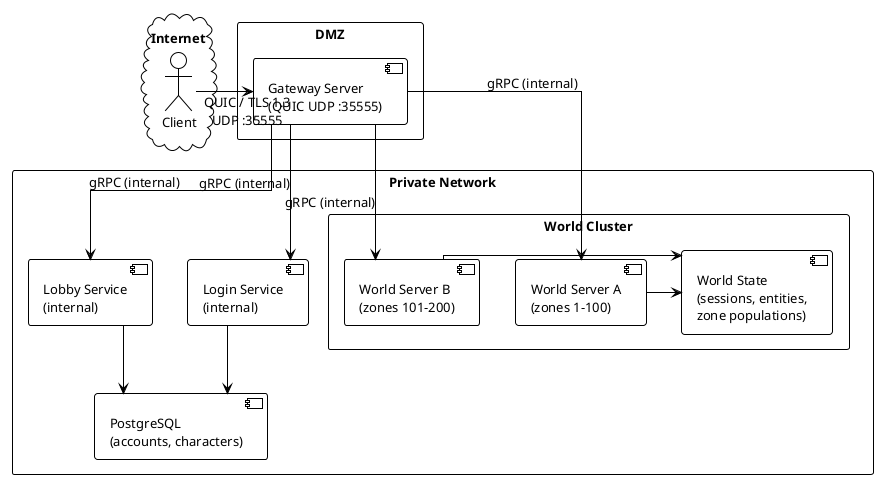
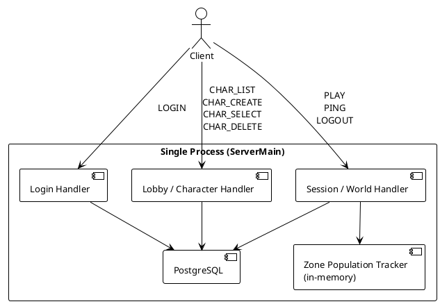
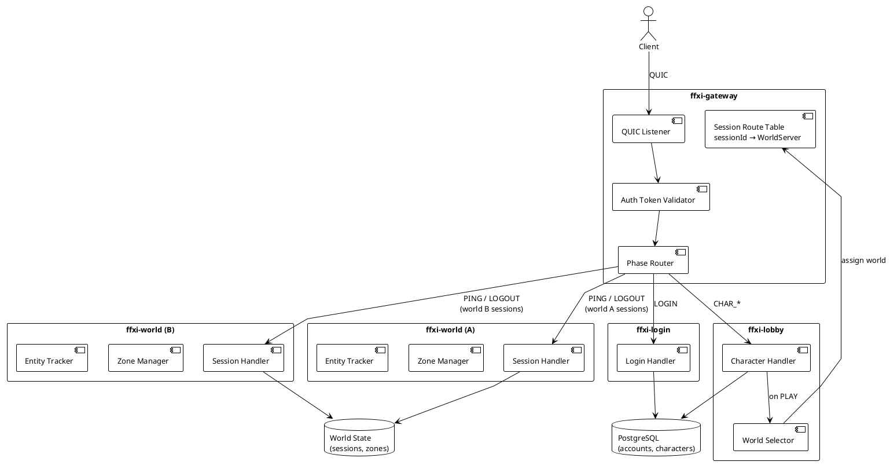
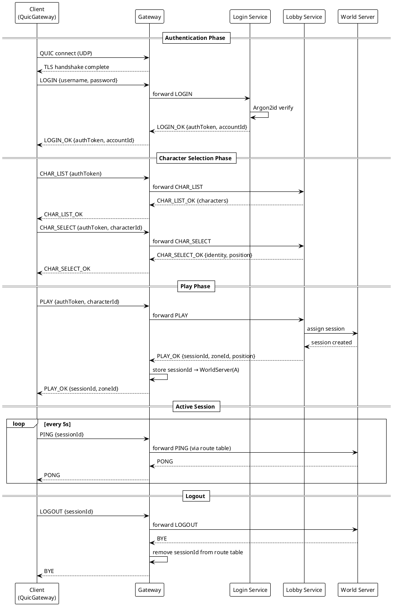
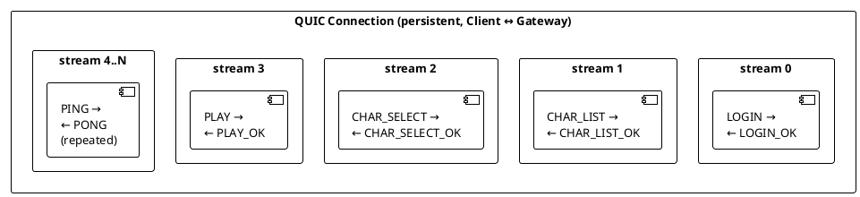
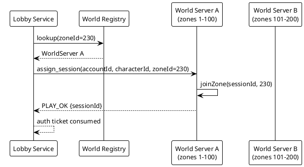

# Network Architecture

## Overview

This document describes the complete network architecture for the FFXI Java project, covering the production server topology, client connection lifecycle, message routing, and phase transitions. PlantUML diagrams are included for each major concept.

This architecture is a deliberate divergence from LandSandBoat (see D-007 in `lsb-divergence.md`). LSB uses direct client-to-zone-server connections after login; this project uses a client-facing gateway that routes all traffic to internal backend services.

---

## 1. Production Topology



**Key properties:**
- The client has **one address** for its entire session lifetime.
- All backend services are unreachable from the internet.
- The gateway maintains a routing table mapping `sessionId → world server` after `PLAY`.
- World servers can be added or restarted without the client noticing.

---

## 2. Current State (Milestone 1)

The milestone 1 single-server deployment collapses everything into one process for simplicity. The internal architecture is already split logically; the gateway split is additive.



---

## 3. Target Multi-Server Topology



---

## 4. Client Connection Lifecycle



---

## 5. Message Routing Table

The gateway holds an in-memory routing table updated at `PLAY` and cleared at `LOGOUT` or session timeout.

```plantuml
@startuml routing
!theme plain
skinparam defaultFontSize 13
skinparam linetype ortho

rectangle "Gateway Route Table" {
  map "phaseRouter" {
    LOGIN => Login Service
    CHAR_LIST => Lobby Service
    CHAR_CREATE => Lobby Service
    CHAR_SELECT => Lobby Service
    CHAR_DELETE => Lobby Service
    PLAY => Lobby Service
    PING => World Server (lookup by sessionId)
    LOGOUT => World Server (lookup by sessionId)
    ZONE_CHANGE => World Server (lookup by sessionId)
  }
}
@enduml
```

---

## 6. QUIC Stream Model

Each logical request/response pair uses a **dedicated bidirectional QUIC stream** on a persistent connection. The connection is maintained for the full session; streams are cheap to open and close.



**Properties:**
- Client (`QuicGateway`) opens one stream per request, writes the request, shuts down output.
- Server reads the request, writes the response, shuts down output.
- Client reads the response on `channelRead` newline detection, completes the `CompletableFuture`.
- Stream fully closes; `QuicChannel` connection persists.

---

## 7. World Server Zone Assignment



---

## 8. Module Breakdown (Target)

| Module | Responsibility | Transport |
|---|---|---|
| `ffxi-gateway` | Client-facing QUIC endpoint, TLS, auth token validation, phase routing, session→world route table | QUIC (external), gRPC (internal) |
| `ffxi-login` | Account auth (Argon2id), auth token issuance | gRPC |
| `ffxi-lobby` | Character CRUD, soft delete, race/job/nation validation, world server assignment on PLAY | gRPC |
| `ffxi-world` | Session lifecycle, zone management, entity tracking, keepalive, movement | gRPC |
| `ffxi-common` | Shared wire codec (`MessageFrame`, `WireCodec`), domain models (`CharacterIdentity`, `RuntimeMode`) | — |
| `ffxi-client` | LWJGL + Dear ImGui desktop client, QUIC transport (`QuicGateway`), all UI phases | QUIC |

---

## 9. Current vs Target

| Concern | Milestone 1 (now) | Target |
|---|---|---|
| Client endpoint | Single `ServerMain` on UDP :35555 | `ffxi-gateway` on UDP :35555 |
| Auth | In `ServerMain` | `ffxi-login` service |
| Character ops | In `ServerMain` | `ffxi-lobby` service |
| Session/world | In `ServerMain` | `ffxi-world` service(s) |
| Internal comms | N/A (single process) | gRPC between gateway and services |
| World scale | Single in-memory map | Multiple `ffxi-world` instances, registry |
| DB | Single PostgreSQL | Shared accounts/chars DB + world state DB |
