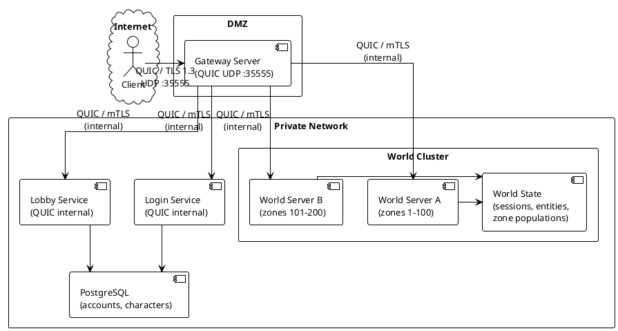
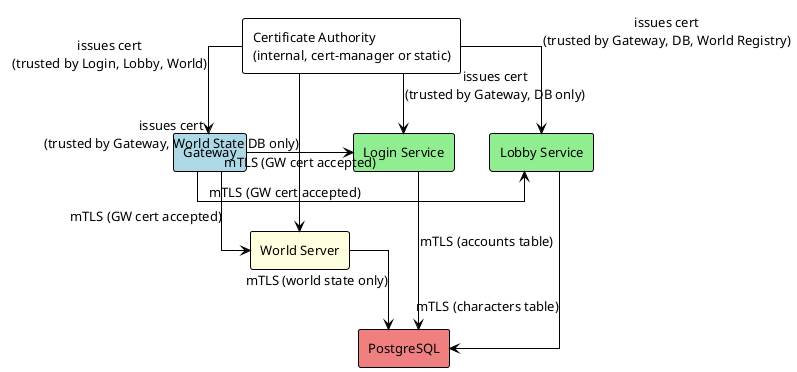
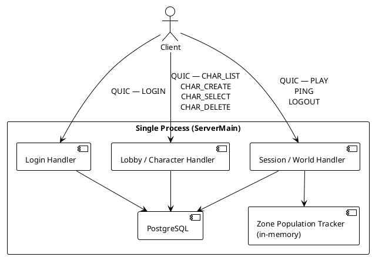
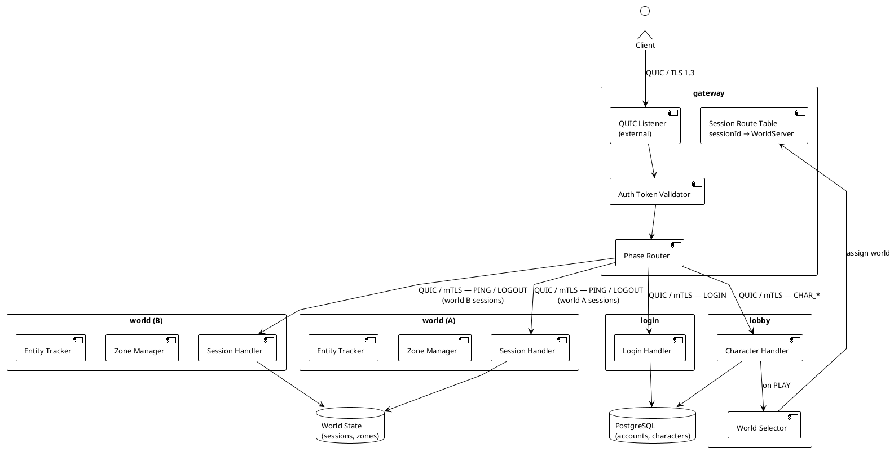
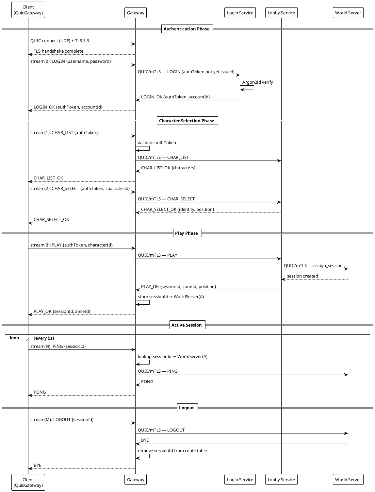
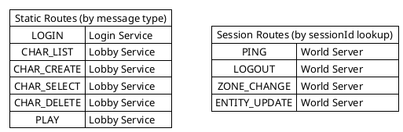
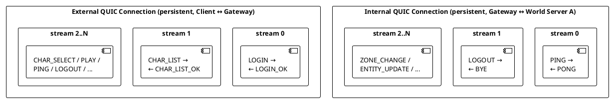
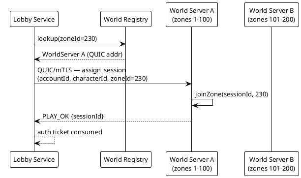

# Network Architecture

## Overview

This document describes the complete network architecture for the Catalyst Java project, covering the production server topology, client connection lifecycle, message routing, internal trust model, and phase transitions. PlantUML diagrams are included for each major concept.

This project uses a client-facing gateway that routes all traffic to internal backend services. QUIC is used for **all** transport — external and internal.

> [!NOTE]
> For the design specification, DTO-agnostic framing, and stateful gateway routing decisions, see [ADR 0001: Stateful Gateway Routing & Apache Fory Serialization](file:///home/samuel/projects/ffxi-java/docs/adr/0001-network-architecture-and-gateway-routing.md).

---

## 1. Production Topology

All communication — client-facing and internal — uses QUIC over UDP. External traffic terminates at the gateway; internal services are unreachable from the internet.

**Key properties:**
- The client has **one address** for its entire session lifetime.
- All backend services are unreachable from the internet — the gateway is the sole public endpoint.
- Internal communication uses the same `MessageFrame`/`WireCodec` stack as the client transport; no second protocol stack.
- The gateway maintains a routing table mapping `sessionId → world server` after `PLAY`.
- World servers can be added or restarted without the client noticing.

---

## 2. Internal Trust Model

### Trust Design
The trust model assumes login and world servers operate behind a gateway. The gateway routes external clients to backend services, avoiding exposing internal services to potential impersonation.

### Why the gateway eliminates this problem

The gateway is the **only** service with a public address. Network-level enforcement (firewall rules, k8s NetworkPolicy) ensures:

1. Internet → gateway only
2. Gateway → backend services only (private CIDR)
3. Backend services cannot be reached from the internet regardless of what code they run

External spoofing of internal sources becomes physically impossible — there is no path from the internet to Login, Lobby, or World. The classic server registry and per-packet source validation are not needed.

### What mTLS adds on the private network

Even inside the private network, mutual TLS (mTLS) ensures that a compromised service cannot impersonate another. The threat model shifts from "external actor spoofing internal source" to "lateral movement from a compromised pod":

### Least-privilege access matrix

| Service | Can reach | Cannot reach |
|---|---|---|
| Gateway | Login, Lobby, World (any) | PostgreSQL directly |
| Login | PostgreSQL (accounts) | Lobby, World, World State DB |
| Lobby | PostgreSQL (characters), World Registry | Login directly, World State DB |
| World | World State DB | Login, Lobby, accounts/characters DB |

### Auth token validation: once at the gateway

Auth tokens are validated **once** at the gateway before forwarding. Backend services trust that any inbound QUIC connection arrived from the gateway (enforced by network position + mTLS cert), and do not re-validate tokens. This eliminates the classic Catalyst pattern of each server maintaining its own session verification chain.

### Production cert management options

| Environment | Approach |
|---|---|
| Dev / single-node | Self-signed cert generated at startup (current) |
| Docker Compose / bare metal | Static internal CA, certs baked into service containers at deploy |
| Kubernetes | cert-manager with a `ClusterIssuer`; automatic rotation, no manual cert lifecycle |

---

## 3. Current State (Milestone 1)

The milestone 1 single-server deployment collapses everything into one process. The gateway split is additive — the internal architecture is already logically separated.

---

## 4. Target Multi-Server Topology

---

## 5. Client Connection Lifecycle

---

## 6. Message Routing Table

The gateway validates the auth token on every pre-session request, then routes by message type. Post-`PLAY`, session messages are routed by `sessionId` lookup.

---

## 7. QUIC Stream Model

Each logical request/response pair uses a **dedicated bidirectional QUIC stream** on a persistent connection. The same model applies on both the external (client ↔ gateway) and internal (gateway ↔ service) connections.

**Properties:**
- One stream per request/response pair — streams are cheap, connections are valuable.
- Client opens a stream, writes request, shuts down output (half-close).
- Receiver writes response, shuts down output.
- Client completes `CompletableFuture` on newline detection in `channelRead`; stream closes.
- `QuicChannel` connection persists across all requests.

---

## 8. World Server Zone Assignment

---

## 9. Module Breakdown (Target)

| Module | Responsibility | External Transport | Internal Transport |
|---|---|---|---|
| `gateway` | Client-facing QUIC endpoint, TLS termination, auth token validation, phase routing, session→world route table | QUIC / TLS 1.3 | QUIC / mTLS |
| `login` | Account auth (Argon2id), auth token issuance | — | QUIC / mTLS |
| `lobby` | Character CRUD, soft delete, race/job/nation validation, world server assignment on PLAY | — | QUIC / mTLS |
| `world` | Session lifecycle, zone management, entity tracking, keepalive, movement | — | QUIC / mTLS |
| `common` | Shared wire codec (`MessageFrame`, `WireCodec`), domain models | — | — |
| `client` | LWJGL + Dear ImGui desktop client, `QuicGateway` transport | QUIC / TLS 1.3 | — |

---

## 10. Current vs Target

| Concern | Milestone 1 (now) | Target |
|---|---|---|
| Client endpoint | Single `ServerMain` on UDP :35555 | `gateway` on UDP :35555 |
| Internal comms | N/A (single process) | QUIC / mTLS between gateway and services |
| Auth | In `ServerMain` | `login` service |
| Auth token validation | In `ServerMain` | Once at gateway; not repeated by backend |
| Character ops | In `ServerMain` | `lobby` service |
| Session/world | In `ServerMain` | `world` service(s) |
| Server-to-server auth | N/A | mTLS pinned certs (dev) / cert-manager (k8s) |
| World scale | Single in-memory map | Multiple `world` instances + world registry |
| DB | Single PostgreSQL | Accounts/chars DB + world state DB |
