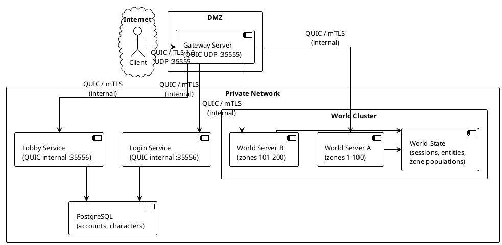
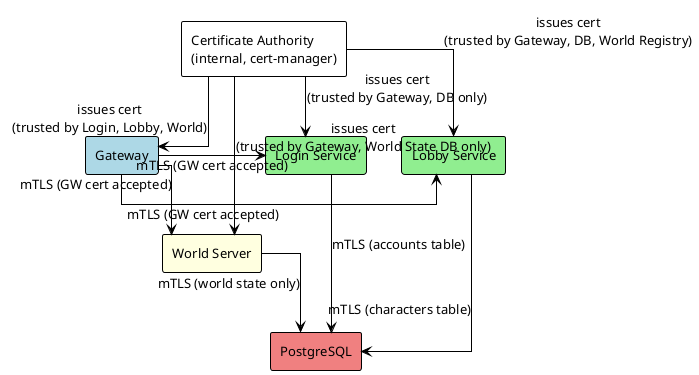
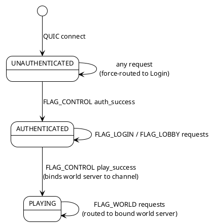
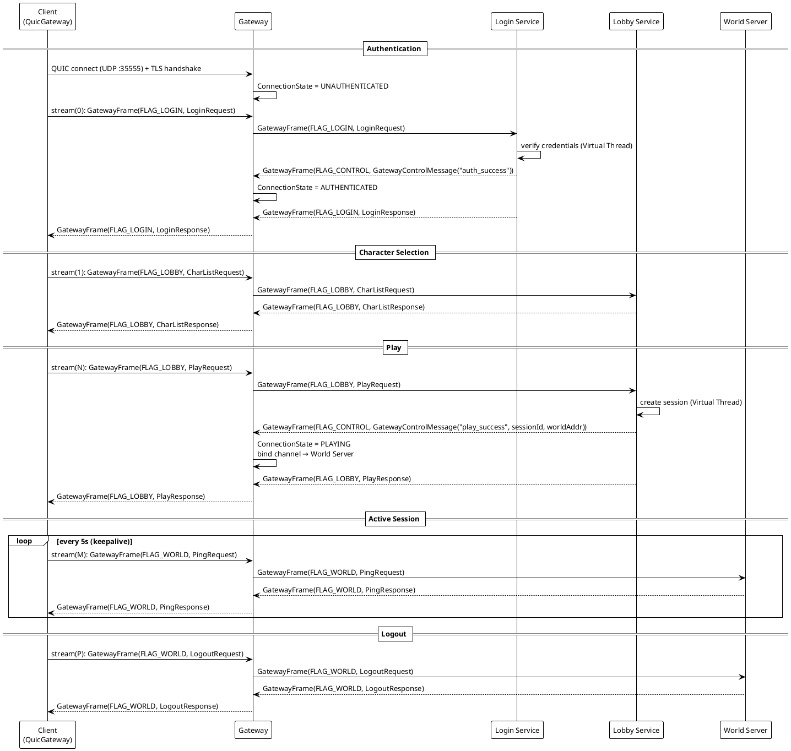
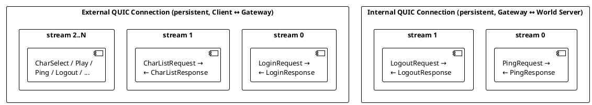
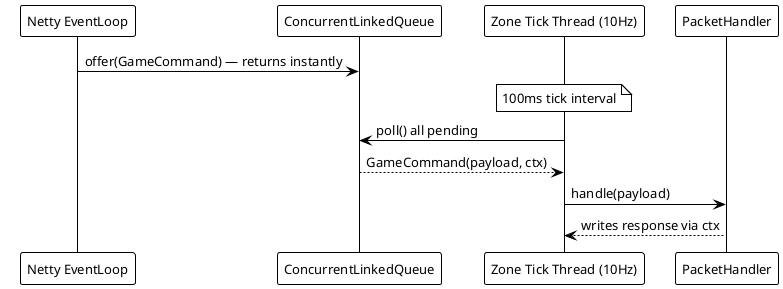

# Network Architecture

## Overview

Catalyst uses QUIC over UDP for **all** transport — both external (client ↔ gateway) and internal
(gateway ↔ backend services). The client has a single public address for its entire session
lifetime. All backend services are unreachable from the internet.

> [!NOTE]
> For the design rationale behind `GatewayFrame`, Apache Fory serialization, and the stateful
> connection machine, see [ADR 0001](adr/0001-network-architecture-and-gateway-routing.md).
> For the gateway request sequence, see [gateway_sequence.puml](gateway_sequence.puml).

---

## 1. Production Topology

**Key properties:**
- The client connects once and reuses the same QUIC connection for its entire session.
- The gateway is the **sole** public endpoint — backend services have no public address.
- Internal gateway ↔ backend communication uses the same `GatewayFrame` / Fory wire stack as the
  external transport. There is no second protocol.
- The gateway maintains a `sessionId → world server` binding per connection after `PLAY`.
- World servers can be scaled or restarted independently without the client noticing.

---

## 2. Internal Trust Model

### Network Position Enforcement
The gateway is the only service with a public address. Kubernetes `NetworkPolicy` enforces:
1. Internet → gateway only (UDP :35555)
2. Gateway → backend services only (private CIDR)
3. Backend services cannot be reached from the internet regardless of code

External spoofing of internal sources is physically impossible — there is no network path from
the internet to Login, Lobby, or World.

### What mTLS Adds on the Private Network
Even inside the private network, mTLS ensures a compromised pod cannot impersonate another
service. The threat model shifts from external spoofing to lateral movement.

### Least-Privilege Access Matrix

| Service | Can reach | Cannot reach |
|---|---|---|
| Gateway | Login, Lobby, World (any) | PostgreSQL directly |
| Login | PostgreSQL (accounts) | Lobby, World, World State DB |
| Lobby | PostgreSQL (characters), World Registry | Login directly, World State DB |
| World | World State DB | Login, Lobby, accounts/characters DB |

### Auth Token Validation: Once at the Gateway
Auth tokens are validated **once** at the gateway before forwarding. Backend services trust that
any inbound QUIC connection arrived from the gateway (enforced by network position + mTLS cert)
and do not re-validate tokens per-request.

> [!NOTE]
> **Current state:** TLS certificates are currently self-signed and generated at startup. Replacing
> these with Cert-Manager-provisioned certificates is tracked in
> [`task-security-tls-certificates.md`](tasks/task-security-tls-certificates.md).

---

## 3. Wire Protocol

### 3.1 Transport Envelope: `GatewayFrame`

Every message on the wire is wrapped in a [`GatewayFrame`](../common/network/src/main/java/catalyst/common/network/GatewayFrame.java):

| Field | Type | Purpose |
|---|---|---|
| `flag` | `byte` | Destination routing (`0x01` Login, `0x02` Lobby, `0x03` World, `0x80` Control) |
| `payload` | `byte[]` | Fory-serialized application DTO — treated as opaque bytes by the gateway |

The gateway **never deserializes** the `payload`. All routing decisions are based solely on the
`flag`.

### 3.2 Serialization: Apache Fory

Application DTOs are serialized using [Apache Fory](https://fory.apache.org/) via
[`ForySerializer`](../common/network/src/main/java/catalyst/common/network/ForySerializer.java).
Class registration is not enforced (`requireClassRegistration(false)`), which keeps the
configuration simple while the DTO surface is still evolving.

All shared DTOs live in the `common-dto` module and implement the `GatewayMessage` marker
interface which declares their routing `flag`.

### 3.3 Gateway Control Messages

State transitions on the gateway are triggered by a dedicated
[`GatewayControlMessage`](../common/network/src/main/java/catalyst/common/network/GatewayControlMessage.java)
record that backend services return alongside their response DTO:

| Command | Sent by | Effect on Gateway |
|---|---|---|
| `auth_success` | Login Service | Transitions connection: `UNAUTHENTICATED` → `AUTHENTICATED` |
| `play_success` | Lobby Service | Transitions connection: `AUTHENTICATED` → `PLAYING`, binds world server |

The gateway swallows `FLAG_CONTROL` frames — they are never forwarded to the client.

> [!NOTE]
> A `logout_success` command to transition `PLAYING` → `AUTHENTICATED` on logout is not yet
> implemented. Tracked in [`task-security-gateway-logout-state.md`](tasks/task-security-gateway-logout-state.md).

---

## 4. Gateway Connection State Machine

The gateway tracks per-connection state via a `ConnectionState` channel attribute on the parent
`QuicChannel`. State is set exclusively by the gateway based on control messages from trusted
backend services — the client has no ability to influence it.

### Routing Rules by State

| Connection State | FLAG_LOGIN | FLAG_LOBBY | FLAG_WORLD |
|---|---|---|---|
| `UNAUTHENTICATED` | ✅ (force-routed) | ❌ rejected | ❌ rejected |
| `AUTHENTICATED` | ✅ | ✅ | ❌ rejected |
| `PLAYING` | ❌ rejected | ❌ rejected | ✅ → bound world server |

---

## 5. Client Connection Lifecycle

---

## 6. QUIC Stream Model

Each request/response pair uses a **dedicated bidirectional QUIC stream** on the persistent
connection. The same model applies to both the external (client ↔ gateway) and internal
(gateway ↔ backend) connections.

**Stream lifecycle:**
1. Initiator opens a bidirectional stream and writes the `GatewayFrame` request.
2. Initiator calls `shutdownOutput()` (half-close) to signal end of request.
3. Receiver reads the frame, processes it, writes the response frame, and calls `shutdownOutput()`.
4. The `CompletableFuture` on the initiator side completes in `channelRead` when the response
   frame arrives. The stream is then closed.
5. The underlying `QuicChannel` connection persists across all streams.

---

## 7. Server-Side Concurrency Model

### Login & Lobby Services — Stateless Concurrent Dispatch
Handlers run on Java Virtual Threads via `StatelessMessageDispatcher`. Each inbound packet is
immediately offloaded from the Netty EventLoop and executed concurrently. Blocking JDBC calls are
safe on virtual threads.

### World Service — Stateful Sequential Tick Loop
The `ZoneMessageDispatcher` runs a **10Hz tick loop (100ms interval)** on a single virtual thread.
All inbound packets are queued into a `ConcurrentLinkedQueue` by the Netty EventLoop and drained
sequentially each tick. This prevents race conditions during concurrent entity, inventory, and
position updates without requiring any explicit locking.

---

## 8. Message Routing Table

| Flag | Message Types | Routes To |
|---|---|---|
| `FLAG_LOGIN` (0x01) | `LoginRequest` | Login Service |
| `FLAG_LOBBY` (0x02) | `CharListRequest`, `CharCreateRequest`, `CharSelectRequest`, `CharDeleteRequest`, `PlayRequest` | Lobby Service |
| `FLAG_WORLD` (0x03) | `PingRequest`, `LogoutRequest` | World Server (bound to connection) |
| `FLAG_CONTROL` (0x80) | `GatewayControlMessage` | Gateway only — swallowed, never forwarded |

---

## 9. Module Breakdown

| Module | Responsibility | External Transport | Internal Transport |
|---|---|---|---|
| `gateway` | Public QUIC endpoint, TLS termination, stateful connection routing, session→world binding | QUIC / TLS 1.3 (UDP :35555) | QUIC / mTLS |
| `login-service` | Account authentication (credential verification), auth token issuance | — | QUIC / mTLS (internal :35556) |
| `lobby-service` | Character CRUD, race/job/nation validation, world server assignment on `PLAY` | — | QUIC / mTLS (internal :35556) |
| `world-service` | Session lifecycle, zone management, entity tracking, keepalive | — | QUIC / mTLS (internal :35556) |
| `server-common` | Shared `PacketHandler<T>` interface, `StatelessMessageDispatcher`, `ZoneMessageDispatcher` base contracts | — | — |
| `common-network` | `GatewayFrame`, `ForySerializer`, `GatewayFrameEncoder/Decoder`, `GatewayControlMessage` | — | — |
| `common-dto` | All shared request/response DTO records implementing `GatewayMessage` | — | — |
| `client-network` | `QuicGateway`, `QuicGatewayService`, `KeepAliveService`, `ClientDispatcher` | QUIC / TLS 1.3 | — |
| `client-application` | State machine (`UnauthenticatedState`, `AuthenticatedState`, `CharacterSelectedState`, `InGameState`) | — | — |
| `client-engine` | GLFW window lifecycle, OpenGL context, render loop, `TaskSchedulerService` | — | — |
