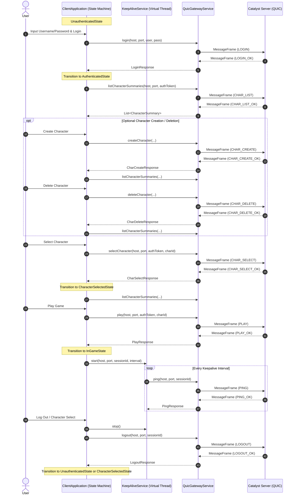
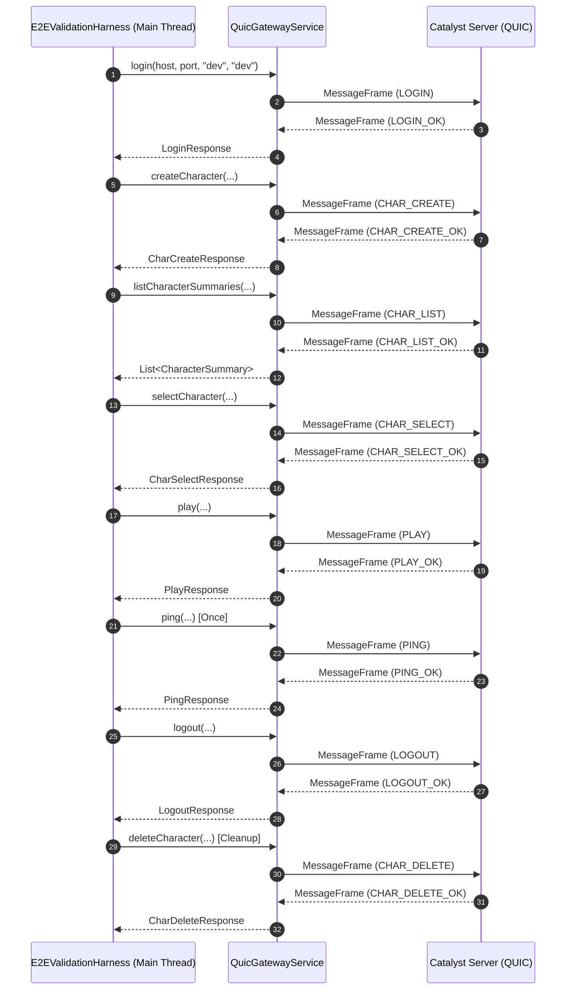

# Milestone 5: Client and E2E Network Interaction Comparison

This document details the call sequences of `QuicGatewayService` methods by the interactive game client (`ClientApplication` via the state machine) versus the automated E2E harness (`E2EValidationHarness`), comparing behaviors and identifying structural divergences.

---

## 1. ClientApplication Network Sequence

In the interactive client, method execution is driven by user UI inputs triggering transitions across the stack-based application states (`UnauthenticatedState`, `AuthenticatedState`, `CharacterSelectedState`, `InGameState`), with pings handled asynchronously by the `KeepAliveService`.

---

## 2. E2E Validation Harness Network Sequence

The `E2EValidationHarness` is a linear, single-threaded script running sequentially from step 1 to step 8.

---

## 3. Comparison and Divergences

An analysis of the two sequences shows they share the same underlying protocol sequence, but differ in execution dynamics and lifecycle context.

### Method Call Commonalities
Both sequences execute the exact same core operations in the same logical order for a standard walkthrough session:
1.  `login(...)`
2.  `createCharacter(...)`
3.  `listCharacterSummaries(...)`
4.  `selectCharacter(...)`
5.  `play(...)`
6.  `ping(...)`
7.  `logout(...)`
8.  `deleteCharacter(...)`

### Divergences and Execution Differences

| Dimension | ClientApplication | E2EValidationHarness |
| :--- | :--- | :--- |
| **Execution Flow** | State-driven & user event-based. | Strictly linear, sequential script. |
| **Threading Model** | Main UI Thread handles transitions. Pings are delegated to virtual background threads in `KeepAliveService`. | Monolithic execution on the main application thread. |
| **Ping Frequency** | Periodic background loop driven by `keepaliveIntervalMs`. | One-shot request validating message roundtrip. |
| **Cleanup Sequencing** | Character deletion is only possible *before* launching game sessions (i.e. from the lobby state). | Character deletion occurs *after* `logout` as a teardown cleanup step. |
| **Exception Handling** | Logs failures to an in-app `DebugLogPanel` and maintains state stability without crashing. | Throws `AssertionError` and aborts execution (terminating the JVM with code 1). |
