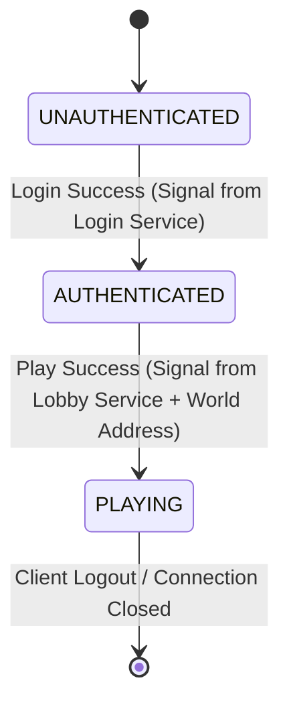

# Gateway Refactoring & Stateful Routing Plan

This document outlines the design and tracking tasks for refactoring the `gateway` module and associated backend routing. The goal is to transition the gateway from **payload-inspection routing** (which requires deserialization, reflection, and type switching) to **connection-state routing** (which keeps the gateway DTO-agnostic, secure, and highly performant).

---

## 🎯 Architecture Goals

1. **DTO-Agnostic Gateway:** The gateway must not import or know about any application DTOs (e.g., `LoginRequest`, `PlayResponse`). It should operate purely at the transport level.
2. **Eliminate Performance Bottlenecks:** Remove `RawFrameCaptureHandler` and the manual byte-copying/accumulation arrays (`PENDING_FRAMES`) that bypass Netty's optimized memory model.
3. **Stateful Connection Security:** Maintain a connection state machine on the gateway (`UNAUTHENTICATED` -> `AUTHENTICATED` -> `PLAYING`) to prevent clients from spoofing routes.
4. **Zero-Reflection Session Routing:** The gateway routes `world` messages based on the state of the persistent QUIC connection, rather than parsing `sessionId` out of Fory request payloads.

---

## 📐 Design Specifications

### 1. Connection State Machine
The gateway tracks the state of each active QUIC connection:



* **UNAUTHENTICATED:** 
  * *Allowed Routes:* Requests are forwarded **only** to the Login Service.
  * *Headers needed:* None. No routing keys are accepted or trusted from the client.
* **AUTHENTICATED:**
  * *Allowed Routes:* Requests are forwarded to the Login Service or Lobby Service.
  * *Routing:* Client sends a simple prefix/header specifying `LOGIN` or `LOBBY`.
* **PLAYING:**
  * *Allowed Routes:* Requests are forwarded to the Login, Lobby, or assigned World Server.
  * *Routing:* Gateway forwards all `world` packets directly to the World Server associated with this connection.

### 2. Transport Header Framing (Gateway Frame)
To allow the gateway to read routing intents and session updates without deserializing Fory payloads, we will prefix all wire payloads with a lightweight **Transport Header**:

```
┌──────────────────┬──────────────────────────────┬──────────────────┬──────────────────────────────┐
┌─── 1 byte ───┬─── 2 bytes ───┬─── N bytes ───┬───────────────── M bytes ──────────────────────────┐
│  Message     │  Metadata     │  Metadata     │                                                    │
│  Type Flags  │  Length (Big) │  String/JSON  │  Fory Payload Bytes (Opaque to Gateway)            │
└─── (Flags) ──┴─── (Length) ──┴── (worldAddr) ┴────────────────────────────────────────────────────┘
```

* **Message Type Flags (1 byte):** 
  * `0x01` = Login Service Destination
  * `0x02` = Lobby Service Destination
  * `0x03` = World Service Destination
  * `0x80` = Control Signal (e.g., Auth Success, Play Success/World Assignment)
* **Metadata Length (2 bytes):** Length of metadata string (e.g., JSON containing redirect info).
* **Metadata String:** Optional UTF-8 payload for control signals (e.g., `{"worldAddress": "127.0.0.1:35002"}`).

---

## 📋 Implementation Task List

- [x] **Step 1: Define Transport Framing & Shared Classes**
  - Define `GatewayFrame` structure in `common/network`.
  - Create a new unified `GatewayPacketDecoder` and `GatewayPacketEncoder` that replaces `ForyDecoder` and `ForyEncoder` in the gateway pipeline.

- [x] **Step 2: Update Backend Service Responses (Signaling)**
  - Update `LoginHandler` to return authentication status in the transport metadata header.
  - Update `LobbyHandler` to return the assigned `worldAddress` in the transport metadata header during the `PLAY` phase response.

- [x] **Step 3: Refactor Gateway Server pipeline**
  - Remove `RawFrameCaptureHandler` and the `PENDING_FRAMES` channel attribute.
  - Implement the `GatewayConnectionState` machine using Netty channel attributes.
  - Bind client connections to target backend QUIC clients dynamically based on state transitions.

- [x] **Step 4: Decouple Gateway from Application DTOs**
  - Delete all DTO imports (`LoginRequest`, `PlayResponse`, etc.) from `GatewayServer`.
  - Replace reflection calls (`getMethod("worldAddress")`) with transport header parses.

- [x] **Step 5: Update Game Client & E2E Validation Harness**
  - Update client network stack to write the 1-byte service flags and read transition headers.
  - Verify that `E2EValidationHarness` runs successfully with stateful routing in place.
