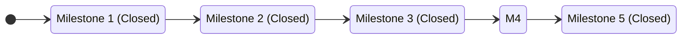
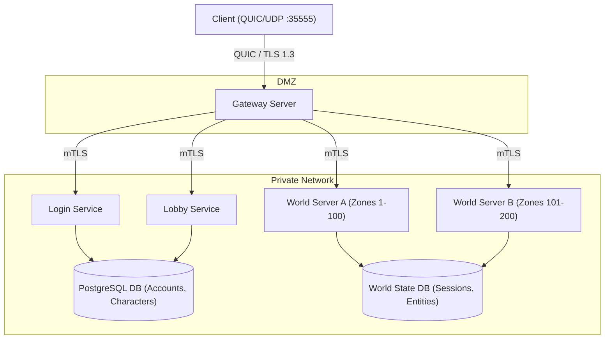
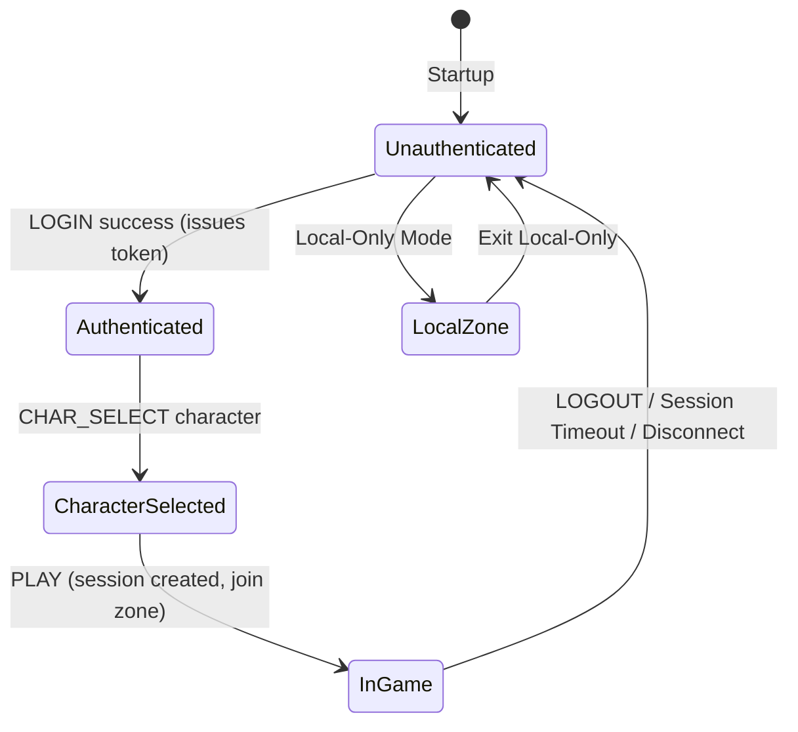
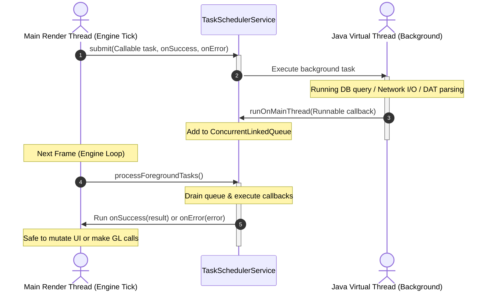
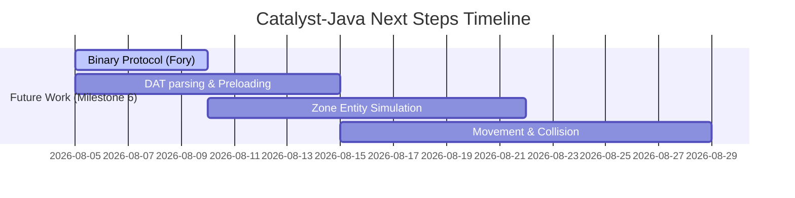

# Catalyst-Java Project Review & Next Steps

This document provides a comprehensive review of the Catalyst-Java project's goals, current status, verified capabilities, and strategic next steps.

---

## 1. Project Objectives & Vision

The core objective of the **Catalyst-Java** project is to build a modern, robust, Java-based client/server recreation of the original game, drawing design inspiration from client simulators like `xim-source` and server architectures like LandSandBoat.

Unlike traditional architectures (such as LandSandBoat/Retail which direct clients to connect to zone servers directly), this project adopts a **centralized Gateway architecture** termination point. All communications utilize **QUIC over UDP** to ensure high-performance, secure, and connection-resilient networking.

---

## 2. Core Project Capabilities

The codebase is structured around a highly decoupled, modular Java architecture across four primary modules:
*   [`common`](file:///home/samuel/projects/ffxi-java/common): Unified protocol DTOs, wire codecs, and concurrency utilities.
*   [`engine`](file:///home/samuel/projects/ffxi-java/engine): The shared client kernel providing GLFW window management, OpenGL 4.6 profile setup, and an ImGui-driven loop.
*   [`client`](file:///home/samuel/projects/ffxi-java/client): State machine-driven game client featuring Dear ImGui overlay panels and a QUIC connection gateway.
*   [`server`](file:///home/samuel/projects/ffxi-java/server): A multi-threaded, reactive game server utilizing Micronaut for dependency injection, Argon2id credentials verification, and PostgreSQL databases for account/character records.

---

## 3. Milestone Status Assessment

### Milestone 1: Connection, Authentication, and Session Kernel
> [!NOTE]
> **Status:** CLOSED (2026-08-03)

*   **Capabilities Delivered:** 
    *   End-to-end client-server slice over QUIC/TLS 1.3 protocol `catalyst-1`.
    *   Argon2id account authentication and unique session registration.
    *   Character CRUD validation rules matching retail ranges (race, body size, starting nation, starter jobs).
    *   Session heartbeats (keepalives via `PING`/`PONG` and 30-second server timeout monitoring).
    *   Phase-locked LWJGL + Dear ImGui client shell with a local-only dev bootstrap.

### Milestone 2: Kernel Architecture
> [!NOTE]
> **Status:** CLOSED (2026-08-04)

*   **Capabilities Delivered:**
    *   Extracted the shared `engine` kernel module.
    *   Adopted **Micronaut DI** framework across all modules (`client`, `server`, `engine`) to eliminate manual constructor boilerplate.
    *   Transitioned the client to a stack-based **Application State Machine** (`ApplicationStateService`) to phase-lock boundaries.
    *   Decoupled server handlers (`LoginHandler`, `LobbyHandler`, `WorldHandler`) from core database access repositories.
    *   Upgraded rendering ceiling to **OpenGL 4.6 core profile context** inside `WindowService`.
    *   Added **Lombok annotations** (`@RequiredArgsConstructor`, `@Slf4j`, `@Value`, `@Builder`) and implemented `WireCodec v2` containing typed builder/accessor APIs.

### Milestone 3: Kernel Concurrency and Typed Contracts
> [!NOTE]
> **Status:** CLOSED (2026-08-05)

*   **Capabilities Delivered:**
    *   **Virtual-Thread Task Scheduler:** Created a shared `TaskSchedulerService` inside `common` executing tasks on `Executors.newVirtualThreadPerTaskExecutor()`.
    *   **Render-Safe Dispatch:** Background tasks utilize a FIFO thread-safe queue (`ConcurrentLinkedQueue`) that drains callbacks via `processForegroundTasks()` inside the engine's main frame loop, preventing multi-threaded rendering mutations.
    *   **Protocol DTO Contracts:** Eliminated raw string-key parsing in client states and server handlers by wrapping all networking APIs in typed request/response contracts (e.g., `LoginRequest`/`LoginResponse`).

### Milestone 4: Structural Cleanups and Conventions
> [!NOTE]
> **Status:** CLOSED (2026-08-05)

*   **Capabilities Delivered:**
    *   Restructured Maven modules hierarchically into `{client, common, server}` directories containing submodules (`engine`, `application`, `network`, `concurrency`, `dto`).
    *   Reorganized namespaces to `catalyst.*` and renamed package declarations.
    *   Stripped all direct mentions of the original retail game or its abbreviations from the codebase, configurations, docker setups, properties, and documentation (with the sole exception of `docs/project-objective.md`).
    *   Tuned down logging to prevent excessively verbose Netty/Quiche debug packet output.

### Milestone 5: Automated E2E and CI Gating
> [!NOTE]
> **Status:** CLOSED (2026-08-05)

*   **Capabilities Delivered:**
    *   **Modular E2E Test Suite:** Extracted E2E Validation Harness into a standalone root-level `tests` module (`catalyst-tests`) targeting only a lightweight `catalyst-client-network` runtime library.
    *   **E2E Validation script:** Stabilized the happy-path integration test (`scripts/run-e2e.sh`) booting a Postgres container, compiling the project, starting the server, executing assertions, and tearing down dependencies cleanly.
    *   **CI Integration:** Designed and implemented a GitHub Actions workflow (`.github/workflows/e2e-ci.yml`) that triggers automatically on commits and pull requests, running the E2E verification test and archiving diagnostic logs on run failures.

---

## 4. Key Architectural Models

### Network Topology

### Client State Transitions

### Concurrency & Dispatch Model

---

## 5. Potential Next Steps & Roadmap

### 1. Transition to Apache Fory Binary Serialization
Implement the binary protocol migration. This replaces the temporary text-based delimited `MessageFrame` protocol with a high-performance binary protocol using Apache Fory.

### 2. Integrate DAT Parser & Table Preloading
Read binary files and DAT maps based on the Kotlin/JS reference client `xim-source`. Establish the table preloading process to query spells, jobs, abilities, and zone settings before loading game instances.

### 3. Implement Zone Entities & Movement Engine
Establish spatial coordinate tracking (`x, y, z, rot`) on client and server. Build a movement interpolation loop, basic zone collisions (terrain meshes), and sync surrounding NPC / PC entity updates.
