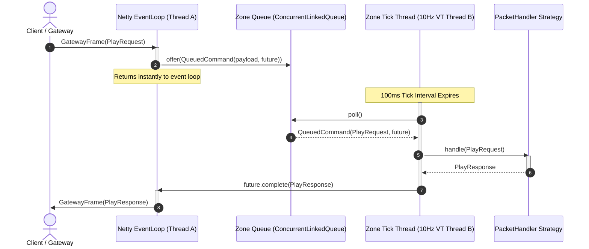

# World Service & Simulation Architecture

This document tracks the details, design decisions, and future tasks for the Catalyst World Service.

---

## 📐 Architecture Details

The **World Service** is a stateful, microservice-based environment responsible for active player sessions, entity management, combat math, and world ticks.

* **Transport:** Internal QUIC endpoint communicating over mutual TLS (mTLS) with the Gateway Server.
* **State Management:** Interacts with the World State database to keep track of active sessions, player positions, and zone populations.
* **Sequential Simulation (`ZoneMessageDispatcher`):** All inbound requests are buffered in a lock-free queue and processed sequentially on a single virtual thread running a **10Hz tick loop (100ms interval)**. This prevents race conditions during concurrent entity/inventory updates.
* **Strategy Pattern:** Fully refactored into class-level `@Singleton` strategy beans implementing `PacketHandler<T>`, registered and routed dynamically by the dispatcher.

### 🧵 World Concurrency & Tick Loop Dispatch

Netty EventLoops instantly offload packets into the lock-free Zone Queue. The Tick Thread drains this queue sequentially every 100ms to preserve thread-safe simulation.

---

## 📋 TODO Tasks (Unprioritized)

- **World Registry Integration:** Integrate with a central World Registry so the Lobby Service can dynamically look up which World Server instance has been assigned to a given `zoneId`.
- **Entity Spawning & Tracking:** Implement basic spatial entity tracking (players, monsters, NPCs) within zones, mapping coordinate updates (`x, y, z, rot`).
- **Session Expiry & Cleanup:** Monitor keepalive timestamps and forcefully clean up database session entries for players who have disconnected or missed heartbeats for over 30 seconds.
- **Cross-Zone Handover:** Establish procedures for handling zone transitions, transferring player states from one World Server instance to another via the Gateway.
